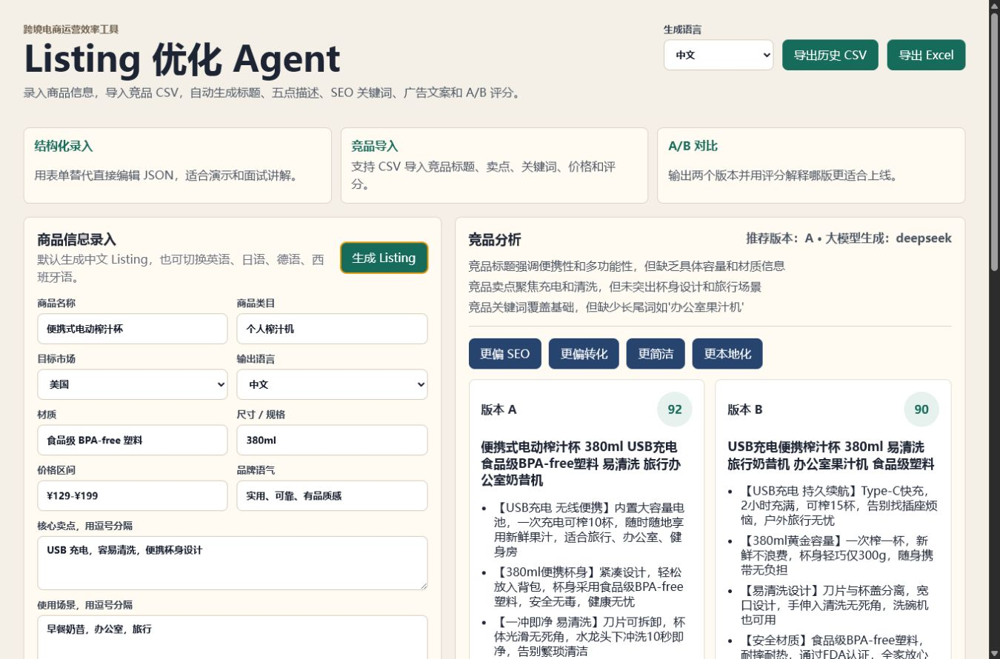
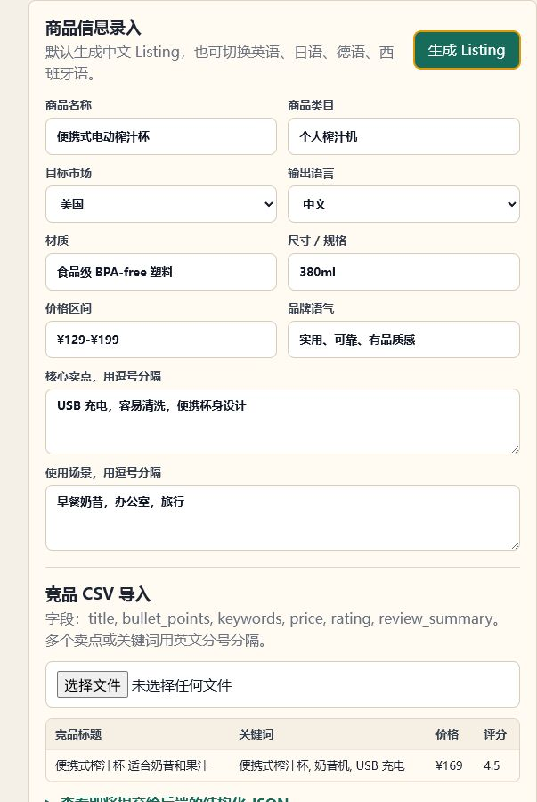
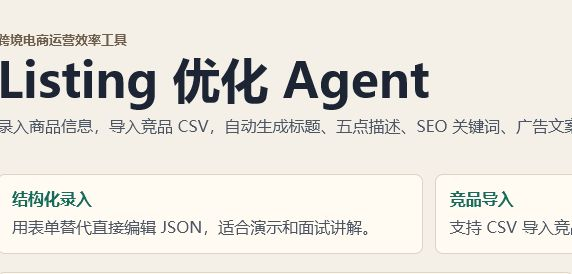
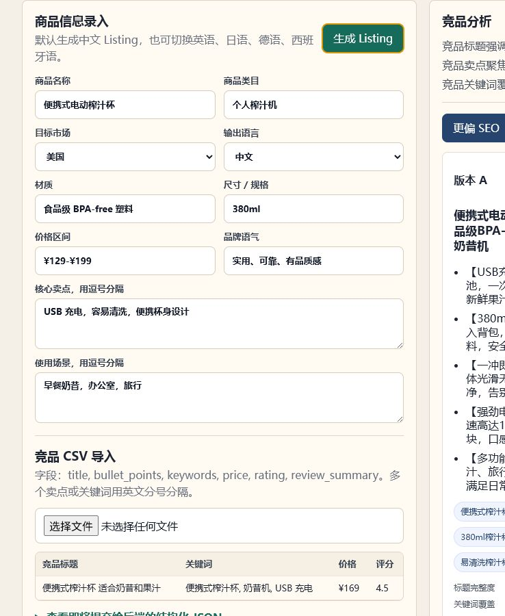
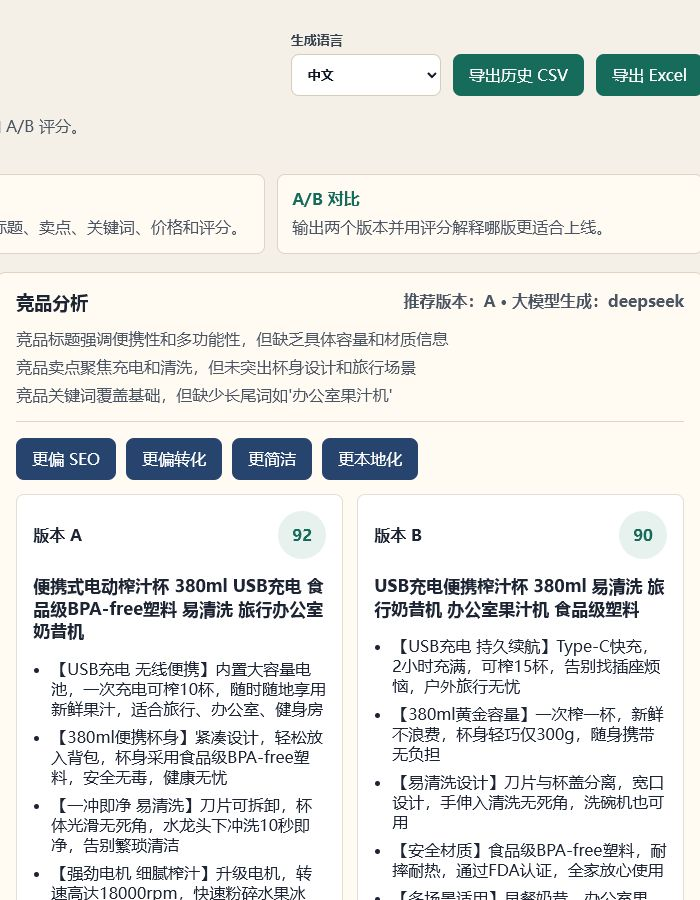
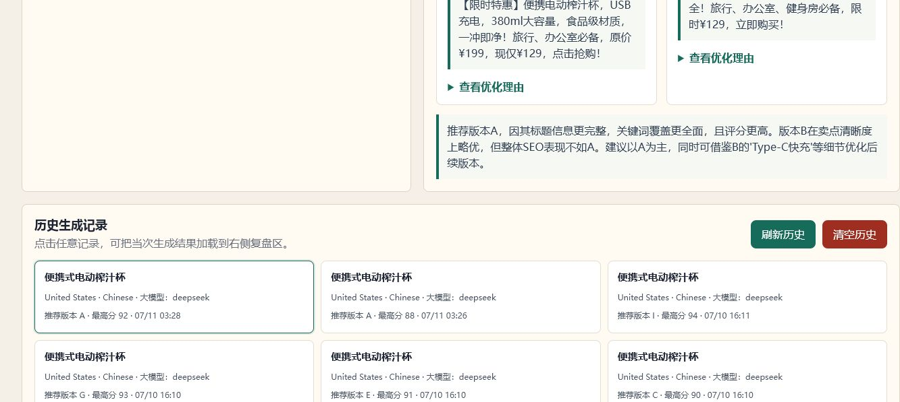
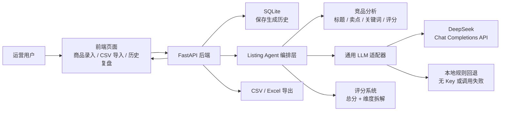
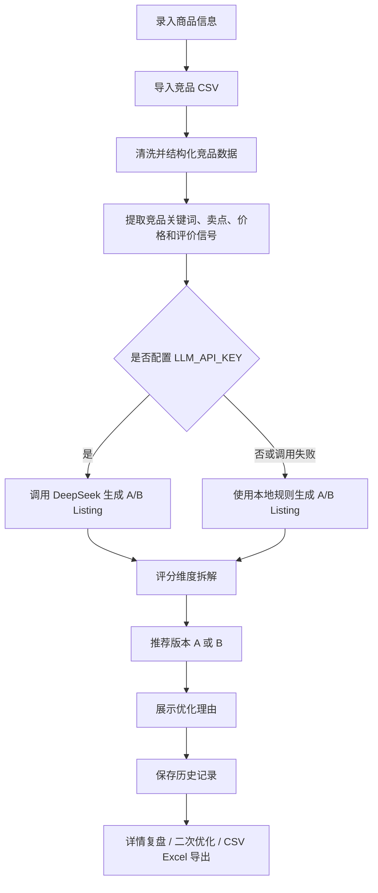
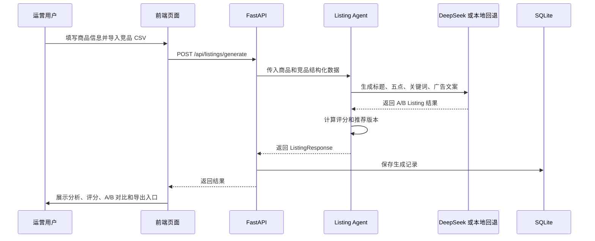

# 跨境电商 Listing 优化 Agent

面向跨境电商运营场景的 AI Agent 作品集项目。系统输入商品资料和竞品信息后，自动完成竞品分析、多语言 Listing 生成、A/B 版本对比、评分拆解、二次优化、历史复盘和 CSV/Excel 导出。

这个项目不是单纯的“文案生成器”，而是把跨境电商运营中的 Listing 优化流程做成可演示、可部署、可写进简历的业务型 Agent。

## 项目价值

跨境电商运营每天都要处理商品上架、标题优化、卖点提炼、关键词布局、广告素材和多语言本地化。如果全部人工完成，效率低且质量不稳定。

本项目把这条流程自动化：

- 运营只需要录入商品信息并导入竞品 CSV。
- Agent 自动分析竞品标题、卖点、关键词、评分和评论摘要。
- 系统生成两个 Listing 版本，并给出推荐版本和评分理由。
- 用户可以继续做 SEO、转化、简洁化、本地化方向的二次优化。
- 最终结果可进入历史复盘页，也可以导出为 CSV 或 Excel 交给运营团队使用。

适合在求职中对应这些岗位关键词：电商运营 Agent、Listing 优化、多语言本地化、广告文案生成、SEO 关键词优化、AI 工作流、运营提效工具。

## 核心功能

- 商品信息结构化录入：商品名、类目、市场、语言、材质、规格、价格、品牌语气、卖点和使用场景。
- 竞品 CSV 导入：支持导入竞品标题、卖点、关键词、价格、评分和评论摘要。
- 多语言生成：默认中文，可切换英语、日语、德语、西班牙语。
- Listing 生成：输出标题、五点描述、SEO 关键词和广告文案。
- A/B 版本对比：每次生成两个版本，并自动推荐更优版本。
- 评分系统：输出总分和五个维度拆解。
- 二次优化：支持更偏 SEO、更偏转化、更简洁、更本地化。
- 历史记录：每次生成自动保存，可点击历史记录加载详情复盘。
- 数据导出：支持历史结果 CSV 和 Excel 导出。
- 大模型适配：使用通用 LLM 适配器，默认支持 DeepSeek。
- 无 Key 回退：未配置 API Key 或调用失败时，自动使用本地规则生成，保证演示不中断。

## 功能截图

### 1. 运营工作台



### 2. 商品信息结构化录入



### 3. 竞品 CSV 导入



### 4. DeepSeek 生成结果



### 5. A/B 对比和评分拆解



### 6. 历史记录和详情复盘



## 技术栈

| 模块 | 技术 |
| --- | --- |
| 前端 | HTML + CSS + JavaScript |
| 后端 | FastAPI + Pydantic |
| 数据库 | SQLite |
| Agent 编排 | 普通 Agent 编排函数，后续可升级 LangGraph |
| 大模型 | OpenAI 兼容 Chat Completions 协议，默认 DeepSeek |
| 回退方案 | 本地规则生成器 |
| 导出 | CSV + 纯标准库 XLSX 生成 |
| 测试 | pytest + FastAPI TestClient |

## 系统架构



## Agent 工作流



## 数据流说明



## 评分维度

每个版本会输出总分和五个维度，方便面试时解释“为什么这个版本更好”：

| 维度 | 含义 |
| --- | --- |
| 标题完整度 | 标题是否包含核心品类、关键卖点、规格和目标市场表达 |
| 关键词覆盖 | 是否覆盖商品词、场景词、长尾词和竞品高频词 |
| 卖点清晰度 | 五点描述是否直接表达用户利益，而不是堆砌参数 |
| 本地化质量 | 是否适配目标市场语言习惯和购物决策关注点 |
| 广告转化潜力 | 广告文案是否突出痛点、利益点和行动导向 |

## 目录结构

```text
crossborder-listing-agent/
  backend/
    app/
      main.py              # FastAPI 路由、CORS、导出接口
      database.py          # SQLite 初始化、保存、查询、清空历史
      schemas.py           # 请求和响应数据结构
      excel_export.py      # Excel 导出
    listing_agent.py       # Agent 编排、LLM 调用、本地回退、评分逻辑
    env_loader.py          # 读取 .env 配置
    .env.example           # DeepSeek 配置模板
    requirements.txt
    tests/
      test_api.py
      test_env_loader.py
      test_listing_agent.py
  frontend/
    index.html             # 页面结构
    app.js                 # 表单、CSV 导入、生成、历史、二次优化
    styles.css             # 页面样式
  sample-data/
    competitors.csv        # 竞品 CSV 示例
    portable-blender.json  # 商品示例
```

## API 设计

| 方法 | 路径 | 作用 |
| --- | --- | --- |
| GET | `/health` | 后端健康检查 |
| POST | `/api/listings/generate` | 根据商品和竞品信息生成 Listing |
| POST | `/api/listings/refine` | 基于已有结果做二次优化 |
| GET | `/api/listings` | 查询历史生成记录 |
| DELETE | `/api/listings` | 清空历史生成记录 |
| GET | `/api/listings/export.csv` | 导出历史记录 CSV |
| GET | `/api/listings/export.xlsx` | 导出历史记录 Excel |

## 本地运行

### 1. 启动后端

```powershell
cd C:\Users\43448\Documents\入职准备\crossborder-listing-agent\backend
pip install -r requirements.txt
uvicorn app.main:app --reload --port 8010
```

健康检查：

```text
http://localhost:8010/health
```

### 2. 配置 DeepSeek

复制环境变量模板：

```powershell
cd C:\Users\43448\Documents\入职准备\crossborder-listing-agent\backend
copy .env.example .env
```

编辑 `backend/.env`：

```env
LLM_PROVIDER=deepseek
LLM_API_KEY=你的 DeepSeek API Key
LLM_BASE_URL=https://api.deepseek.com
LLM_MODEL=deepseek-v4-flash
```

`.env` 已加入 `.gitignore`，不会提交到 GitHub。

### 3. 启动前端

```powershell
cd C:\Users\43448\Documents\入职准备\crossborder-listing-agent\frontend
python -m http.server 5173 --bind 127.0.0.1
```

打开：

```text
http://127.0.0.1:5173
```

## 无 Key 回退说明

无 Key 回退指的是：如果没有配置 `LLM_API_KEY`，或者 DeepSeek 接口调用失败，系统不会报错中断，而是自动使用本地规则生成一份可演示的 Listing。

这样设计是为了保证面试演示稳定：

- 没有 API 额度时也能完整展示流程。
- 网络或 Key 临时异常时，项目仍然可运行。
- 前端会清楚展示生成来源：`大模型生成：deepseek` 或 `本地规则回退`。

## 竞品 CSV 格式

CSV 表头必须包含：

```text
title,bullet_points,keywords,price,rating,review_summary
```

说明：

- `title`：竞品标题。
- `bullet_points`：竞品五点描述，多个卖点用英文分号分隔。
- `keywords`：竞品关键词，多个关键词用英文分号分隔。
- `price`：价格。
- `rating`：评分。
- `review_summary`：评论摘要。

示例文件：

```text
sample-data/competitors.csv
```

## 演示流程

1. 打开前端页面。
2. 填写商品名称、商品类目、目标市场、输出语言、价格区间、核心卖点和使用场景。
3. 导入 `sample-data/competitors.csv`。
4. 点击“生成 Listing”。
5. 查看竞品分析结论、A/B 标题、五点描述、SEO 关键词、广告文案和评分拆解。
6. 点击“更偏 SEO / 更偏转化 / 更简洁 / 更本地化”做二次优化。
7. 在历史记录中点击任意记录，加载当次详情进行复盘。
8. 点击“导出历史 CSV”或“导出 Excel”，模拟运营交付物导出。

## 功能截图清单

截图建议和作品集展示顺序见：

```text
docs/功能截图清单.md
```

建议优先截：首页工作台、商品结构化录入、竞品 CSV 导入、DeepSeek 生成结果、A/B 对比评分、二次优化、历史复盘、Excel 导出。

## 测试

```powershell
cd C:\Users\43448\Documents\入职准备\crossborder-listing-agent\backend
python -m pytest -q
```

测试覆盖：

- Listing 生成接口。
- 二次优化接口。
- 历史查询和清空。
- CSV/Excel 导出。
- `.env` 配置加载。
- 无 Key 本地回退。
- 中文 Listing 生成和评分维度。

## 简历写法

**跨境电商 Listing 优化 Agent | FastAPI + SQLite + DeepSeek**

- 独立开发面向跨境电商运营的 AI Agent，支持商品信息录入、竞品 CSV 导入、多语言 Listing 生成、A/B 版本对比、评分拆解和历史导出。
- 设计通用 LLM 适配器，默认接入 DeepSeek，并实现无 Key 本地规则回退，保证项目在面试演示中稳定运行。
- 使用 FastAPI + Pydantic 构建后端接口，使用 SQLite 保存生成历史，支持 CSV 和 Excel 导出运营结果。
- 将 Listing 质量拆解为标题完整度、关键词覆盖、卖点清晰度、本地化质量、广告转化潜力五个维度，提高生成结果的可解释性。

## 面试讲解要点

可以按这个顺序讲：

1. **业务问题**：跨境电商运营需要频繁优化 Listing，人工整理竞品、改写标题、生成卖点和广告文案很耗时。
2. **解决方案**：我做了一个 Listing 优化 Agent，把商品录入、竞品分析、多语言生成、评分、A/B 对比和导出串成完整流程。
3. **技术实现**：前端负责结构化录入和结果展示，FastAPI 负责接口和数据保存，Agent 层负责竞品分析、LLM 调用、本地回退和评分。
4. **稳定性设计**：真实配置 Key 时调用 DeepSeek，没有 Key 或接口失败时使用本地规则回退，保证演示不中断。
5. **商业价值**：它能把运营从重复文案工作中解放出来，并用评分维度解释为什么某个版本更适合上线。

## 后续规划

- 前端升级为 React 或 Next.js，增强组件化和部署能力。
- 使用 LangGraph 拆分竞品分析、生成、评分、复盘等节点。
- 使用 Playwright 抓取真实竞品页面，减少手动整理 CSV。
- 增加图片卖点识别，让商品图也参与 Listing 优化。
- 增加账号体系和项目维度，支持多个店铺或多个商品批量管理。
- 部署到云服务器或 Vercel + 后端服务，形成在线演示地址。
